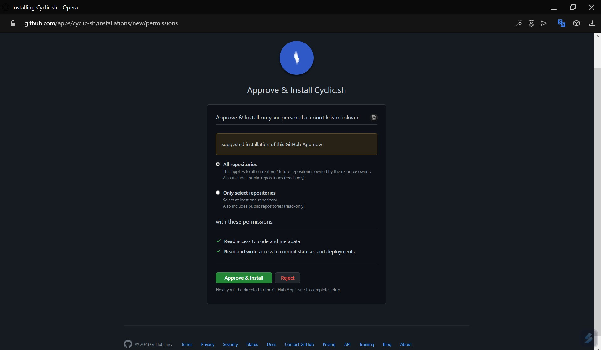

# Deploy Some Code - Quick Start - Deploy to Cyclic

1. Klik [disni](https://docs.cyclic.sh/) lalu klik pada **Quick Start** selanjutnya klik ```Deploy To Cyclic```
    
    

2. Akan direct ke akun cyclic dan diminta untuk Continue with GutHub

    
    
3. Berikan izin untuk bergabung dengan Cyclic

    
    
4.  Masukkan password akses ke git anda

    
    
5.  Akan connect cycluc ke repository express-hello-world, lalu klik **Connect**

    
  
6.  Lalu akan ke tampilan approve & install Cyclic,sh, klik Approve & Install

    
    
7.  Build dan Deploying aplikasi akan berjalan pada repository express-hello-world, jika berhasil akan muncul tampilan **"You're Live!"**

     
 
 8.  Ketika sudah berhasil, cobalah membuka URL yang disediakan setelah proses build dan deploy selesai

     

