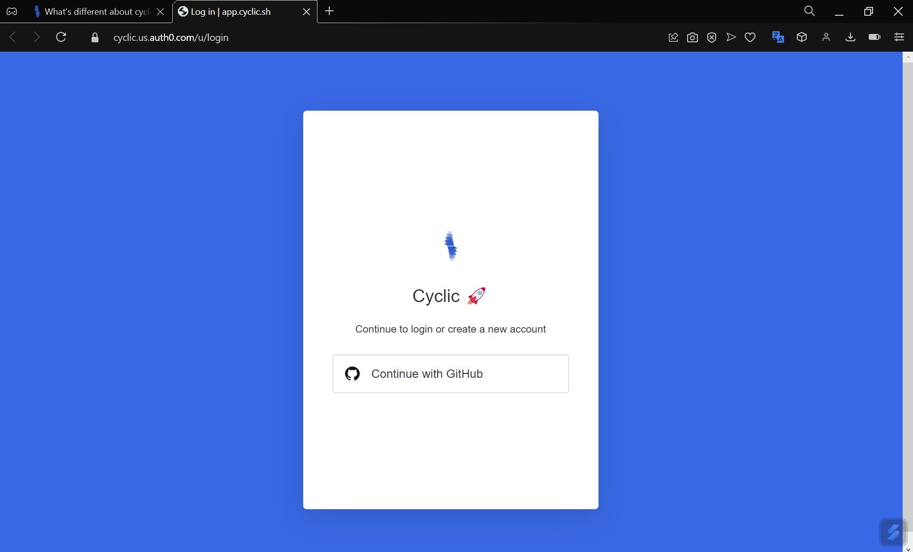

# Deploy Some Code - Quick Start - Deploy to Cyclic

1. Klik [disni](https://docs.cyclic.sh/) lalu klik pada **Quick Start** selanjutnya klik ```Deploy To Cyclic```
    
    

2. Akan direct ke akun cyclic dan diminta untuk Continue with GitHub yang anda gunakan

    
    
3. Berikan perizinan untuk Account Github bergabung dengan Cyclic, Klik Autorize cyclic-software

    
    
4.  Masukkan password akses pada git anda, otomatis isi jika anda sudah login GitHub

    
    
5.  Maka Akan connect cyclic ke repository express-hello-world, dan klik **Connect**

    
  
6.  Langkah Selanjutnya klik tampilan approve & installasi Cyclic.sh, klik Approve & Install

    
    
7.  Build dan Deploying aplikasi akan berjalan pada repository express-hello-world, jika berhasil akan muncul tampilan **"You're Live!"**

     
     
     Lalu Klik pada Go-to express-hello-world
      
 
 8.  Cobalah buka URL yang disediakan setelah proses build dan deploy >> https://dark-ruby-puffer-shoe.cyclic.app
    

Jika berhasil, hasilnya sbb :
     

