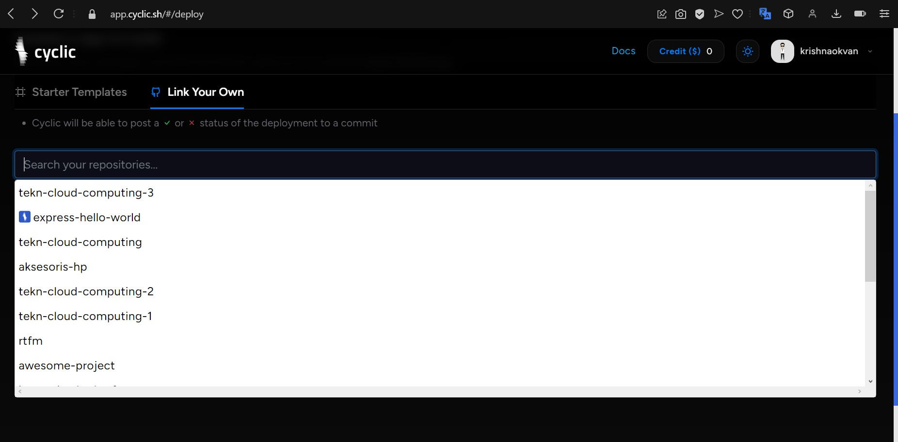
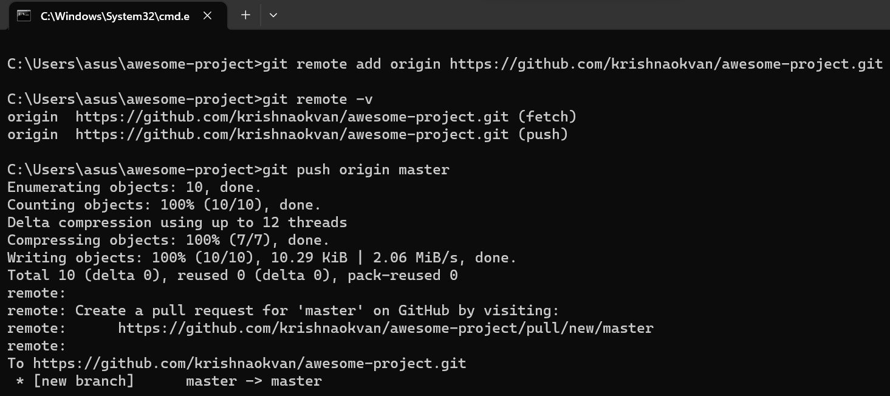
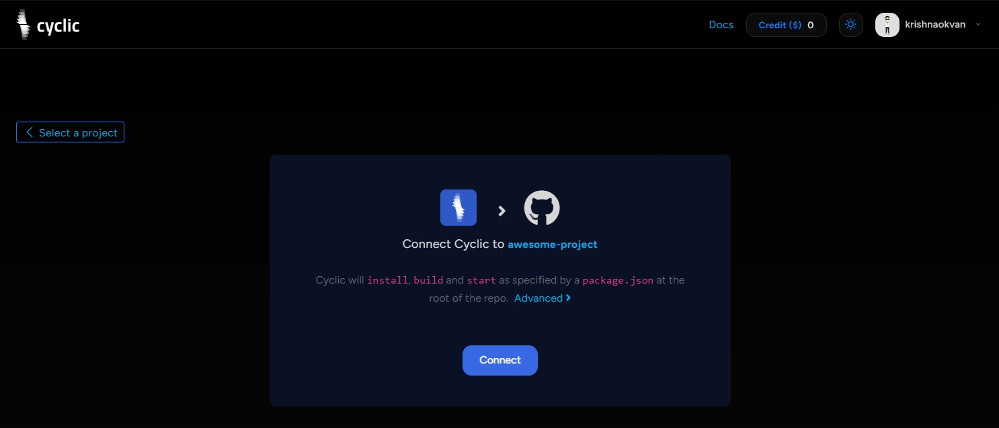

# Deploy Some Code - DIY

1. Buka [link ini](https://docs.cyclic.sh/) lalu scoll sampai anda menemukan **DIY** link >> https://app.cyclic.sh/api/login


- klik tampilan approve & installasi Cyclic.sh, klik Approve & Install

    

2. Akan direct ke akun cyclic dan diminta untuk Continue with GutHub

    
    
3. Berikan izin untuk bergabung dengan Cyclic

    
    
- Mengkoneksikan serta hasi logs nya, sbb : 
    
    
- Langkah selanjutnya, menuju ke dasbord awesome-project : 
    
    
    
    
4. Buat files package.json dan package-lock.json 

NB : jika belum install npm maka anda install terlebih dahulu 

** NPM : https://nodejs.org/en
    

** Konfigurasi pada cmd
    

```npm init y``` perintah untuk membuat file package.json


 ```npm i express mongoose dotenv``` perintah untuk membuat file package-lock.json

        
        
5. Buat file script index.js untuk mendapatkan tampilan web 

   
     
- Script Package.json

    
    
    
6. Langkah selanjutnya, Push master kedalam repository git

- git add. untuk menambahkan repo

   
   
   
- lalu git commit utk menyimpan apabila ada perubahan
   

- git push untuk mentrasfer files
   
   
7. Lalu ke website cyclic. di dashboard akan menampilkan pilihan **Starter Tamplate** dan **Link Your Own**. Pilih yang **Link Your Own** dan pilihlah salah satu repository yang sudah memiliki file json. Disini akan menggunakan repository **awsome-project**.

        

    
8.  Mengkoneksikan Cyclic ke Awesome-project, sbb:

        
     
 - Berikut tes app dengan link yang sudah disediakan
    


