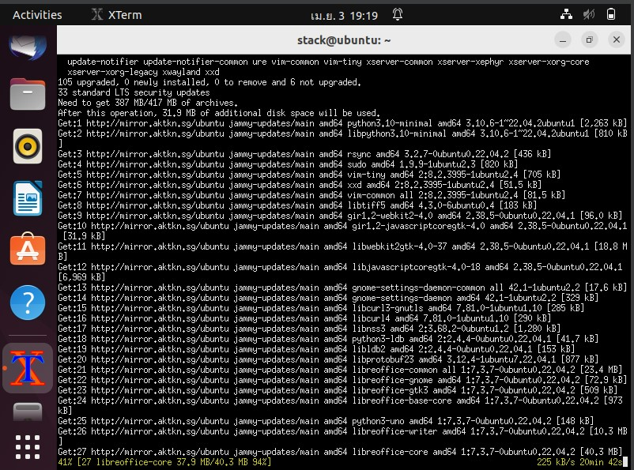
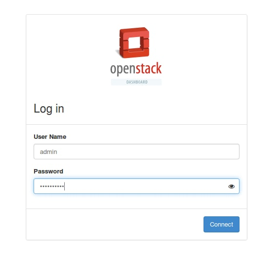

# OpenStack Deployment on Ubuntu with DevStack
### Step 1: Update Ubuntu System
Login, update, upgrade and reboot your Ubuntu system.
```bash
osboxes@krishnaokvan:~$ sudo apt-get update
osboxes@krishnaokvan:~$ sudo apt -y upgrade
osboxes@krishnaokvan:~$ sudo apt -y dist-upgrade
osboxes@krishnaokvan:~$ sudo reboot
```
Hasilnya sbb :




### Step 2: Add Stack User
For other installations of Ubuntu 18.04, run the commands below to create DevStack deployment user.
```bash
osboxes@krishnaokvan:~$ sudo useradd -s /bin/bash -d /opt/stack -m stack
```
Enable sudo privileges for this user without need for a password.
```bash
osboxes@krishnaokvan:~$ echo "stack ALL=(ALL) NOPASSWD: ALL" | sudo tee /etc/sudoers.d/stack
stack ALL=(ALL) NOPASSWD: ALL
```
Switch to stack user, test the internet connection and check version of Python.
```bash
osboxes@krishnaokvan:~$ sudo su - stack
stack@krishnaokvan:~$ 
```
![1]

### Step 3: Download DevStack
Clone Destack deployment code from Github.
```bash
stack@krishnaokvan:~$ git clone https://git.openstack.org/openstack-dev/devstack
```
Create a local.conf file with 4 passwords and Host IP address.
```bash
stack@krishnaokvan:~$ cd devstack
stack@krishnaokvan:~/devstack$ nano local.conf
```
.jpg)
### Step 4: Start Openstack Deployment on Ubuntu 18.04 with DevStack
Now that you’ve configured the minimum required config to get started with DevStack, start the installation of Openstack.
```bash
stack@krishnaokvan:~/devstack$ FORCE=yes ./stack.sh
```
DevStack will install;
This will take a 15 – 20 minutes, largely depending on the speed of your internet connection. At the end of the installation process, you should see output like this:
```bash
This is your host IP address: 10.0.2.15
This is your host IPv6 address: 2401:ee00:1040:100:2c8d:5afa:b7e:c0a0
Horizon is now available at http://10.0.2.15/dashboard
Keystone is serving at http://10.0.2.15/identity/

The default users are: admin and demo
The password: StrongAdminSecret
```

