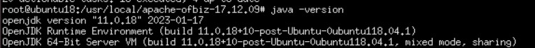
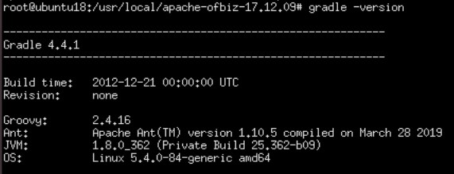
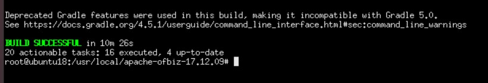
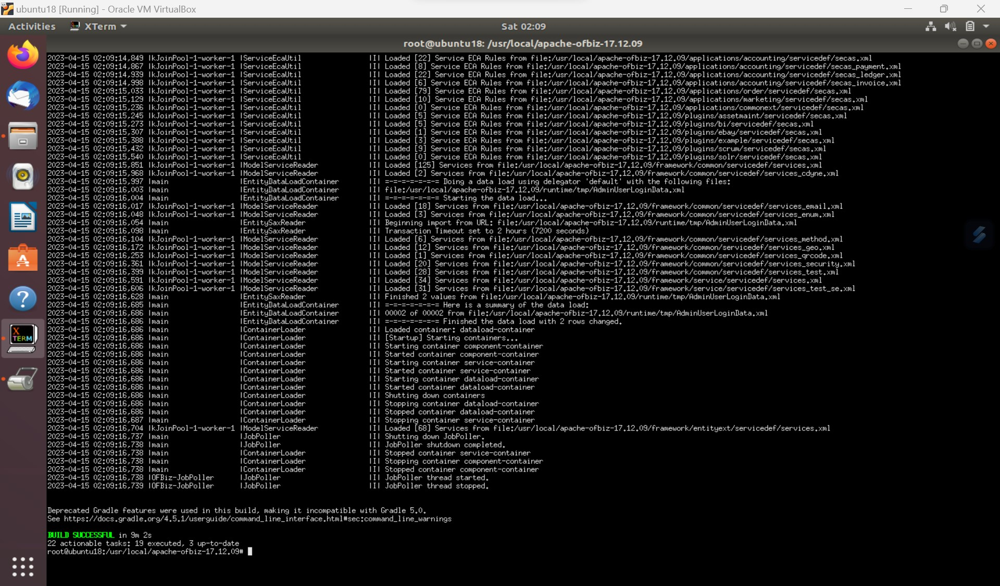
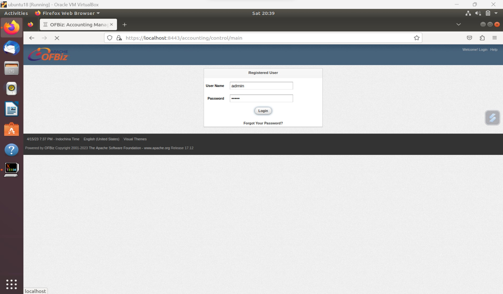
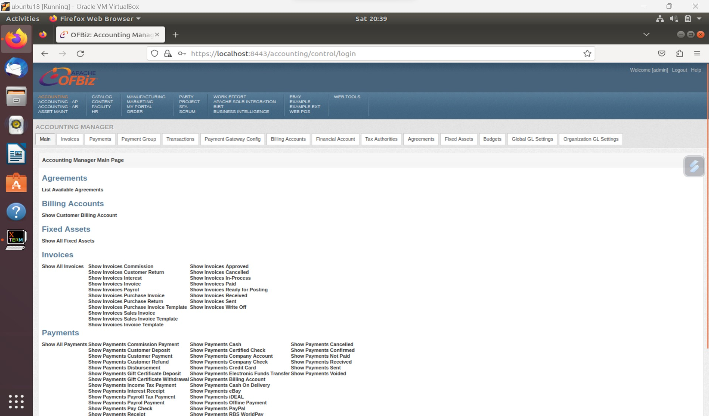

# Apache OFBiz Installation
Apache OFBiz (The Apache Open For Business Project) adalah paket bisnis perusahaan Apache Foundation. Apache OFBiz merupakan produk open source untuk otomatisasi proses perusahaan yang mencakup komponen framework dan aplikasi bisnis untuk ERP (Enterprise Resource Planning), CRM (Customer Relationship Management), E-Bisnis / E-Commerce, SCM (Supply Chain Management) , MRP (Manufacturing Resource Planning), MMS / EAM (Maintenance Management System / Enterprise Asset Management), POS (Point Of Sale).

### Install Packet yang dibutuhkan
Install paket Java dan Gradle
```bash
krishnaokvan@ubuntu:~$ sudo apt update
krishnaokvan@ubuntu:~$ sudo apt install openjdk-8-jdk openjdk-8-jre
krishnaokvan@ubuntu:~$ sudo apt-get install adoptopenjdk-8-hotspot -y
krishnaokvan@ubuntu:~$ sudo apt-get install gradle
krishnaokvan@ubuntu:~$ java -version
krishnaokvan@ubuntu:~$ gradle -version
```

Setelah itu cek apakah sudah terinstall pada device anda/pada os linux ubuntu v18.<br>
<br>

<br>

### Instalasi OFBiz
Download OFBiz, kemudian extract file yang telah didownload.
```bash
krishnaokvan@ubuntu:~$ wget https://https://downloads.apache.org/ofbiz/apache-ofbiz-18.12.07.zip
krishnaokvan@ubuntu:~$ unzip apache-ofbiz-18.12.07
krishnaokvan@ubuntu:~$ cd apache-ofbiz-18.12.07
krishnaokvan@ubuntu:~/apache-ofbiz-18.12.07$ sudo ./gradlew cleanAll loadAll
```

Tunggu sampai proses instalasi selesai.<br>
<br>

### Akses OFBiz 
Jalankan service OFBiz, kemudian akses melalui browser. 
```bash
krishnaokvan@ubuntu:~/apache-ofbiz-18.12.07$ ./gradlew cleanAll "ofbiz --load-data readers=seed,seed-initial" loadAdminUserLogin -PuserLoginId=admin 
```
<br>

Setelah menginstal Apache OFBiz, Gunakan perintah berikut untuk memulai layanan Apache OFBiz di sistem.

### Berikut cara untuk login dan URL Apache OfBiz :

Untuk login, user/password: admin/ofbiz<br>
Default dashboard: https://localhost:8443/ordermgr/control/main<br>
Catalog Manager: https://localhost:8443/catalog<br>
E-Commerce: https://localhost:8443/ecommerce<br>
WebTools: https://localhostP:8443/webtools<br>

<br>

<br>
