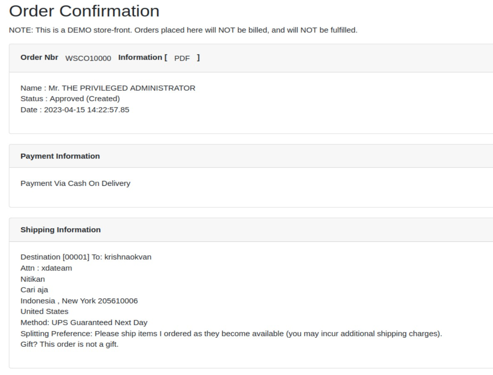

# Apache OFBiz Demo
## Front End E-Commerce Webstore Tutorial

### Akses Web Demo E-Commerce
Untuk demo dapat diakses melalui URL berikut, [demo](https://demo-stable.ofbiz.apache.org/ecommerce/control/main) 
  
Kemudian login dengan menggunakan, user/password: admin/ofbiz 
  
### Pilih Product dan Add to Cart
Disini saya memilih produk yaitu Configurable PC, 
  
Pilih konfigurasi sesuai kebutuhan kemudian klik Add to Cart, 
  
Produk yang sudah di-Add akan masuk ke Cart, 
  
### Proses Check Out
Klik View Cart, Centang produk kemudian klik Check Out, 
  
Klik New Address untuk menambah alamat baru tujuan pengiriman, 
  
Isikan alamat, disini Saya memasukan alamat khusus Demo, lalu klik Save, 
  
Klik kembali View Cart, centang produk, lalu Check Out, 
  
Alamat yang sebelumnya dimasukan sudah muncul, lalu klik Next, 
  
Pilih jasa pengiriman, lalu masukan alamat email untuk konfirmasi dan klik Next, 
  
Pilih metode pembayaran, lalu klik Continue to Final Order Review, 
  
Pastikan detail sudah sesuai, lalu klik Submit Order, 
  
### Order Confirmation
Maka Akan muncul Order Confirmation, tandanya order sudah berhasil.., 
  
