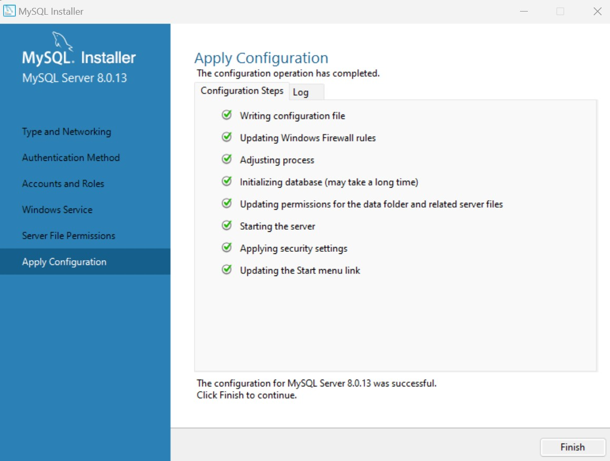

# Install Go, MySQL dan MongoDB

## Install Go 
1. Download GO Installer melalui [Golang](https://golang.org/doc/install)

2. Install GO dan Cek versinya.
<div align="center"></div><br>

Tunggu sampai Instalasi Selesai..
<div align="center"></div><br>
Cek Versi Go, Apakah sudah terpasang di device..
<div align="center"></div><br>

## Install MySQL
1. Download MySQL Installer melalui [MySQL](https://dev.mysql.com/downloads/installer/)

2. Install MySQL dan Cek versinya.

<div align="center"></div><br>
Pada jendela “Choosing a Setup Type”, terdapat beberapa pilihan tipe instalasi. Mulai dari untuk developer default, server only, client only, full hingga custom.

Karena kita akan menggunakan MySQL dalam tahap pengembangan program, mungkin pilihan “Developer Default” adalah yang paling pas. Namun opsi ini menginstall cukup banyak aplikasi, bisa sampai 10 komponen serta memakan ruang harddisk lebih dari 1GB. Yang kita perlukan saat ini hanyalah MySQL Server.

Akan tetapi, jika memilih Server Only kita tidak bisa mengubah folder instalasi MySQL. Oleh karena itu pilih Custom kemudian klik tombol Next.

<div align="center"></div><br>

Terdapat 2 isian: Install Directory yang akan menjadi folder tempat file program MySQL. Dan Data Directory dimana file data seperti database dan tabel berada. Saya akan mengubah Install Directory ke C:\MySQL 8.0 dan Data Directory ke C:\MySQL 8.0\Data. Kedua folder ini tidak harus ada terlebih dahulu karena MySQL akan membuatnya secara otomatis. Akhiri dengan men-klik tombol OK, kemudian klik Next.
<div align="center"></div><br>

Pada Jendela Installation ini, akan ditampilkan produk dan fitur apa saja yang ingin diinstal. Karena kita hanya memilih MySQL Server 8.0.13, maka hanya 1 produk ini yang akan diinstall. Silahkan klik tombol Execute untuk memulai Proses Instalasi MySQL Server.
Proses instalasi akan memakan waktu beberapa saat, dan ketika selesai, klik tombol Next beberapa kali hingga kita masuk ke bagian konfigurasi awal MySQL.

<div align="center"></div><br>

Pada jendela ini pilih “Standalone MySQL Server / Classic MySQL Replication” karena kita hanya akan menjalankan MySQL di satu komputer saja. Klik tombol Next.
<div align="center"></div><br>

Di jendela konfigurasi “Type and Networking” biarkan settingan default Development Computer dan port MySQL di 3306. Klik tombol Next.
<div align="center"></div><br>

Jendela berikutnya adalah Account and User Role. Pada bagian ini kita akan membuat password untuk user root dan jika diinginkan juga bisa membuat user lain.

Pada bagian atas, kita harus menginput password untuk user root. Root adalah user tertinggi di dalam MySQL, atau sering disebut juga dengan superuser. User root memiliki hak akses kepada semua tabel dan database, termasuk menghapus seluruh database yang ada. Karena kita menggunakan MySQL server ini di komputer sendiri dan hanya untuk proses belajar, silahkan input password yang mudah diingat, saya akan menggunakan password.

Pada bagian bawah terdapat pilihan untuk menambah user lain selain root. Namun untuk saat ini kita tidak memerlukannya, dan kita akan mempelajari cara membuat user dari dalam MySQL nanti. Akhiri jendela ini dengan men-klik tombol Next.
<div align="center"></div><br>

checkbox “Configure MySQL Server as Windows Service” dipilih, MySQL akan diinstall sebagai “Windows Service”. Artinya, MySQL akan langsung aktif setiap Windows berjalan.
<div align="center"></div><br>

Jendela terakhir adalah “Apply Configuration”. Disini seluruh setingan yang sudah kita pilih akan diterapkan. Klik tombol Execute.
<div align="center"></div><br>

<div align="center"></div><br>

Setelah beberapa saat, seluruh konfigurasi sudah diterapkan. Klik tombol Finish.
<div align="center"></div><br>

Di jendela Product Configuration tidak ada pengaturan yang harus kita pilih, langsung saja klik tombol Next.
<div align="center"></div><br>

Menguji Instalasi MySQL : 
Untuk menguji apakah MySQL sudah terinstall dengan sempurna, kita akan coba mengakses MySQL Command Line Client dari menu Start –> MySQL –> MySQL 8.0 Command Line Client.
<div align="center"></div><br>

## Install MongoDB
1. Download MongoDB Installer melalui [MongoDB](https://www.mongodb.com/try/download/community?tck=docs_server)
<div align="center"></div><br>
Instalasi telah selesai .. 
<div align="center"></div><br>

2. Install MongoDB dan Cek versinya.
```bash
C:\Program Files\MongoDB\Server\6.0\bin
```
<div align="center"></div><br>

<div align="center"></div><br>


