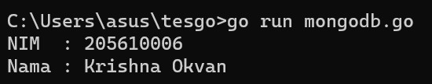

# Program Go: koneksi dan membaca data dari MySQL dan MongoDB
## Mysql
1. Buat direktori baru, kemudian instal module dan driver yang diperlukan.

 

 

2. Buat database MySQL dan MongoDB, lalu masukan data kedalamnya.

 

3. Setelah itu membuat file GO dengan nama [mysql.go](https://github.com/krishnaokvan/tekn-cloud-computing/blob/master/minggu-06/mysql.go)

4. Lalu jalankan file tersebut di cmd.

 

## MongoDB
1. Instal modul dan driver yang diperlukan, lalu buat database dan isikan datanya.

 

2. Lalu buat file GO dengan nama [mongodb.go](https://github.com/krishnaokvan/tekn-cloud-computing/blob/master/minggu-06/mongodb.go)

3. Selanjutnya jalankan filenya di cmd.

 
