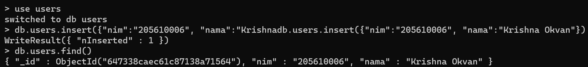

# Gin RESTful API membaca data dari MySQL dan MongoDB
## MySQL
1. Buat direktori baru dengan nama mysql-restfulapi, kemudian instal module dan driver yang diperlukan.

 

 

2. Jalankan program yang telah dibuat.

 

## MongoDB
1. Create database baru pada MongoDB.

 

2. Buat file program untuk membaca data pada database yang telah dibuat.  

 
