# DockerHub Image Golang

1. Create dan masuk ke direktori baru, kemudian pull image [Golang](https://hub.docker.com/_/golang). 

 

2. Cek Image atau Container yang berada di Docker. 

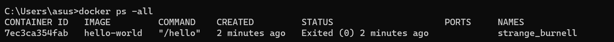
 

3. Buat direktori baru dengan nama "tesdocker" dan clone sample docker. [instalasi](https://github.com/dockersamples/node-bulletin-board) 

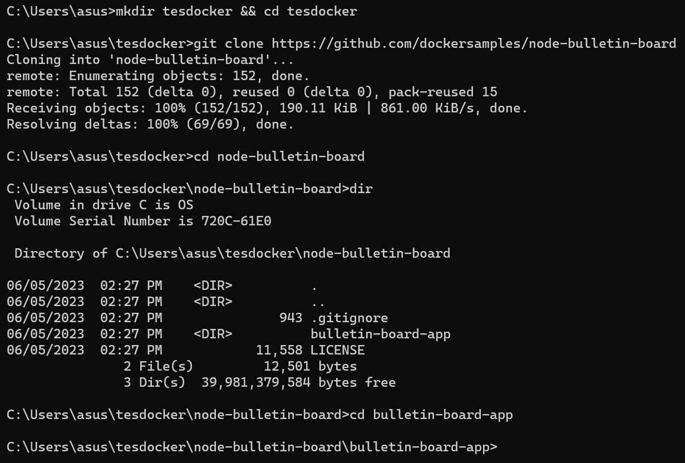
 

4. Masuk ke dalam direktori sample docker dan build sample. 

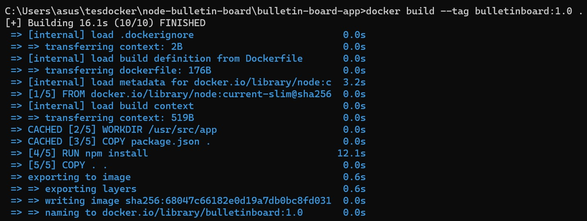
 

5. Setelah berhasil terbuild, publish sample docker supaya dapat diakses. Klik **Allow access** untuk mengizinkan. 

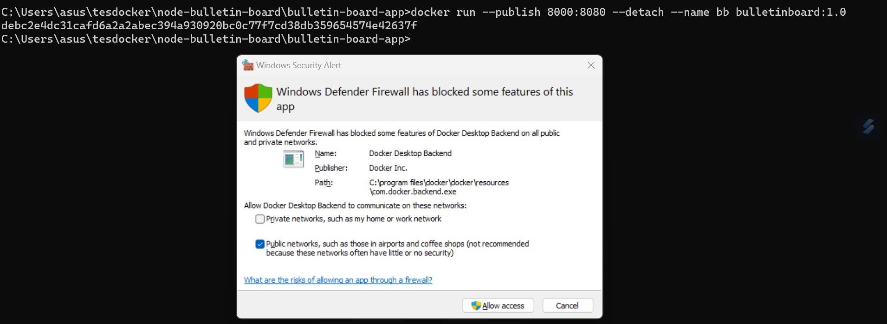
 

6. Akses sample docker melalui web browser dengan mengetikkan [URL] (localhost:8000). 

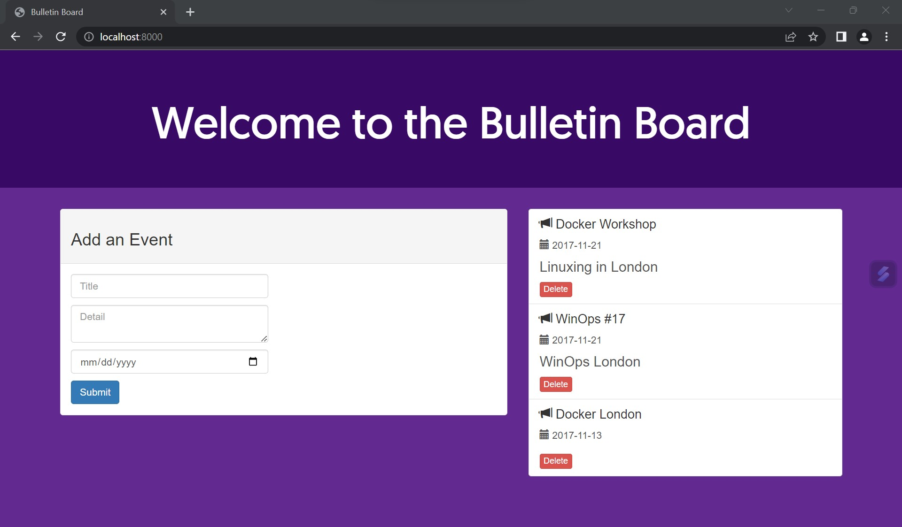
 

7. Push sample pada docker lokal ke docker hub lalu lakukan login ke [Docker Hub](https://hub.docker.com/) dan create repository baru. 

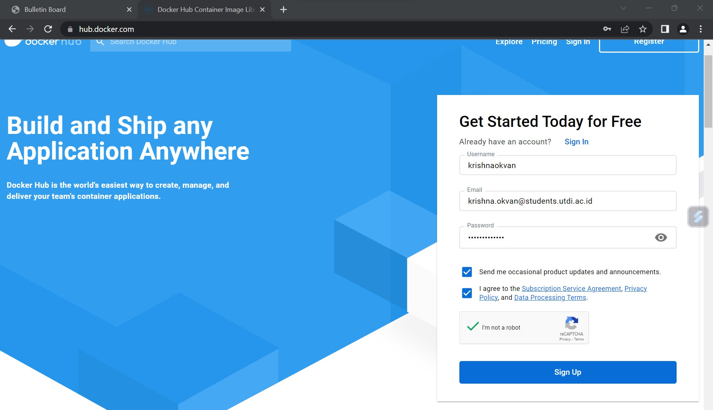
 

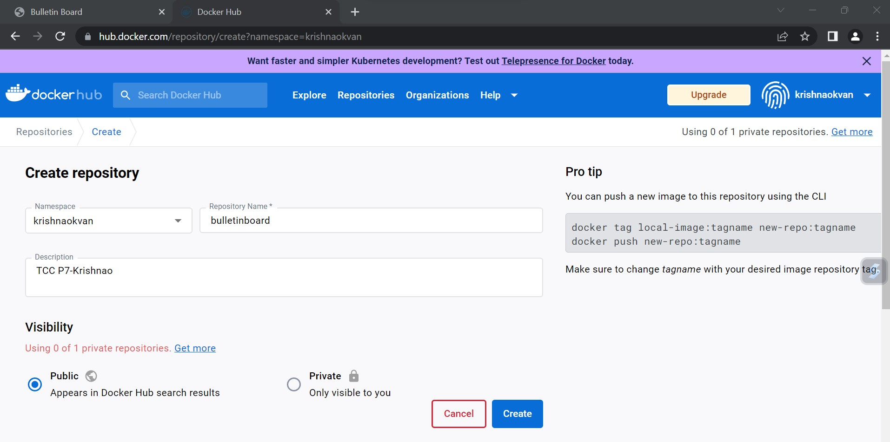
 

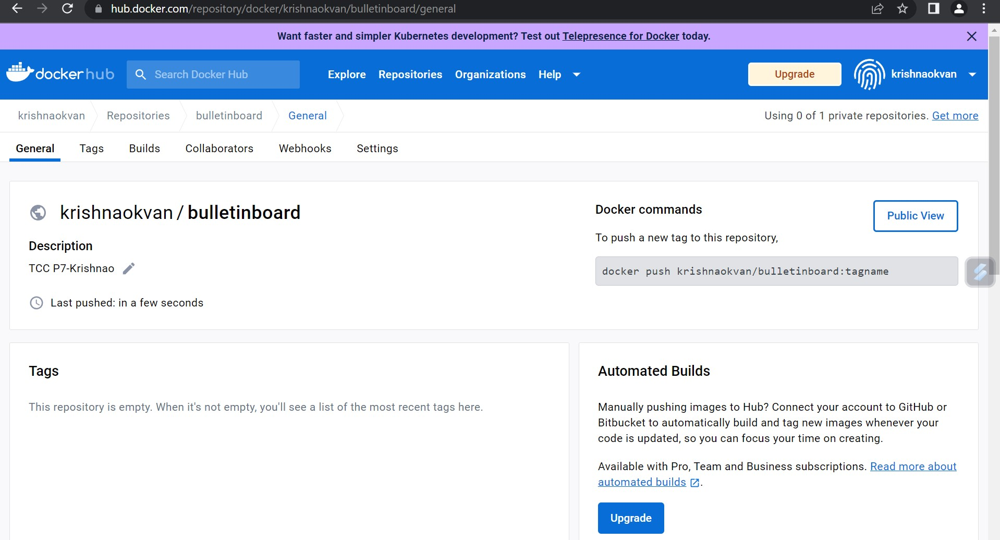
 

8. Lakukan login pada Docker lokal dengan akun Docker Hub, kemudian buat tag pada sample docker dan push sample ke Docker Hub. 

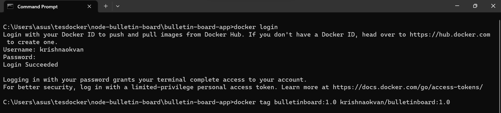
 
Jika sudah dibuat hasilnya, sbb :

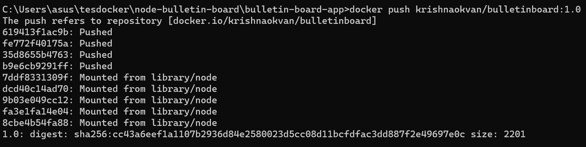
 

9. Buka dan Cek Docker Hub, Pastikan sudah muncul sample dengan tag seperti gambar dibawah ini 

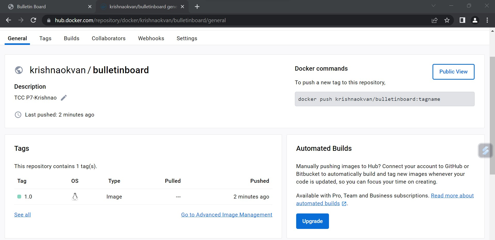
 
