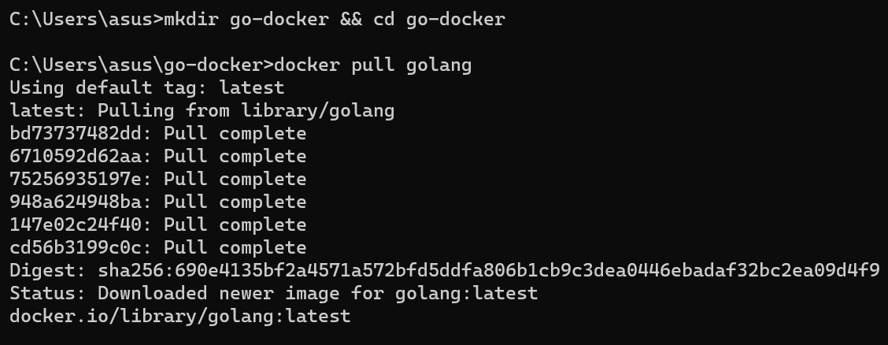

# Tugas
## DockerHub Image

1. Membuat direktori baru dengan nama file go-docker lalu pull image [golang](https://hub.docker.com/_/golang) 

2. Clone docker image seperti gambar dibawah dengan cara run pada CMD 

3. Membuat file dengan format main.go 

4. Lalu buat module.go dengan perintah init dan build sample image docker 

5. Membuat file dengan nama DockerFile pada [C:\Users\asus\tesdocker\go-docker]  

- File Go.mod pada direktori file [C:\Users\asus\tesdocker\go-docker]

6. Setelah menjalankan server sample image docker, lalu checklist kedua pilihan pada windows security alert .. Klik Allow Acces

7. Buka link URL [localhost:8888] pada browser/Google Anda.. 

