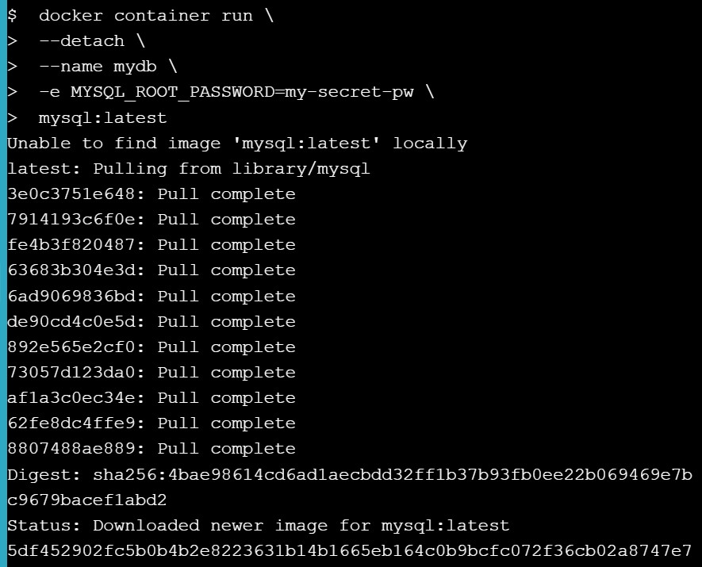

# Docker for Beginners - Linux

Laporan beserta gambar dibawah ini adalah hasil praktikum melalui [Docker for Beginners - Linux](https://training.play-with-docker.com/beginner-linux/), sehingga untuk materi dan penjelasan lebih detailnya dapat diakses melalui web tersebut.

### Task

- Task 0: Prerequisites 
- Task 1: Run some simple Docker containers 
- Task 2: Package and run a custom app using Docker 
- Task 3: Modify a Running Website

## Task 0: Prerequisites

You will need all of the following to complete this lab: 
- A clone of the lab’s GitHub repo. 
- A DockerID.

### Clone the Lab’s GitHub Repo

Use the following command to clone the lab’s repo from GitHub (you can click the command or manually type it). This will make a copy of the lab’s repo in a new sub-directory called ```linux_tweet_app```.
<div></div><br>

### Make sure you have a DockerID

If you do not have a DockerID (a free login used to access Docker Hub), please visit [Docker Hub](https://hub.docker.com/) and register for one. You will need this for later steps.

## Task 1: Run some simple Docker containers 

There are different ways to use containers. These include: 
1. To run a single task: This could be a shell script or a custom app. 
2. Interactively: This connects you to the container similar to the way you SSH into a remote server. 
3. In the background: For long-running services like websites and databases. 

In this section you’ll try each of those options and see how Docker manages the workload.

### Run a single task in an Alpine Linux container

<div></div>
<div></div>

### Run an interactive Ubuntu container
- Run the following commands in the container.
<div></div>
<div></div>
<div></div>

### Run a background MySQL container

<div></div>
<div></div>
<div></div>
<div></div>
<div></div>
<div></div>
<div></div>

## Task 2: Package and run a custom app using Docker 

In this step you’ll learn how to package your own apps as Docker images using a [Dockerfile](https://docs.docker.com/engine/reference/builder/). 

The Dockerfile syntax is straightforward. In this task, we’re going to create a simple NGINX website from a Dockerfile.

### Build a simple website image

<div></div>
<div></div>
<div></div>
<div></div>
<div></div>
<div></div>

## Task 3: Modify a Running Website

### Start our web app with a bind mount

<div></div>
<div></div>
<div></div>

### Modify the running website

<div></div>
<div></div>
<div></div>
<div></div>
<div></div>
<div></div>

### Update the image

<div></div>
<div></div>

### Test the new version

<div></div>
<div></div>
<div></div>
<div></div>

### Push your images to Docker Hub

Hasil pada dockerHub : 
<div></div>
