# Docker Orchestration Hands-on Lab

The report below is the results of the practicum accessed via [Docker Orchestration Hands-on Lab](https://training.play-with-docker.com/orchestration-hol/), materials and more detailed explanations can be accessed through the website.

### Steps

- [Section #1 - What is Orchestration](https://github.com/isaanggi/tekn-cloud-computing/new/main/minggu-12#section-1-what-is-orchestration)
- [Section #2 - Configure Swarm Mode](https://github.com/isaanggi/tekn-cloud-computing/new/main/minggu-12#section-2-configure-swarm-mode)
- [Section #3 - Deploy applications across multiple hosts](https://github.com/isaanggi/tekn-cloud-computing/new/main/minggu-12#section-3-deploy-applications-across-multiple-hosts)
- [Section #4 - Scale the application](https://github.com/isaanggi/tekn-cloud-computing/new/main/minggu-12#section-4-scale-the-application)
- [Section #5 - Drain a node and reschedule the containers](https://github.com/isaanggi/tekn-cloud-computing/new/main/minggu-12#section-5-drain-a-node-and-reschedule-the-containers)
- [Cleaning Up](https://github.com/isaanggi/tekn-cloud-computing/new/main/minggu-12#cleaning-up)

## Section 1: What is Orchestration

So, what is Orchestration anyways? Well, Orchestration is probably best described using an example. Let’s say that you have an application that has high traffic along with high-availability requirements. Due to these requirements, you typically want to deploy across at least 3+ machines, so that in the event a host fails, your application will still be accessible from at least two others. Obviously, this is just an example and your use-case will likely have its own requirements, but you get the idea.

Deploying your application without Orchestration is typically very time consuming and error prone, because you would have to manually SSH into each machine, start up your application, and then continually keep tabs on things to make sure it is running as you expect.

But, with Orchestration tooling, you can typically off-load much of this manual work and let automation do the heavy lifting. One cool feature of Orchestration with Docker Swarm, is that you can deploy an application across many hosts with only a single command (once Swarm mode is enabled). Plus, if one of the supporting nodes dies in your Docker Swarm, other nodes will automatically pick up load, and your application will continue to hum along as usual.

If you are typically only using ```docker run``` to deploy your applications, then you could likely really benefit from using Docker Compose, Docker Swarm mode, or both Docker Compose and Swarm.

<div align="center">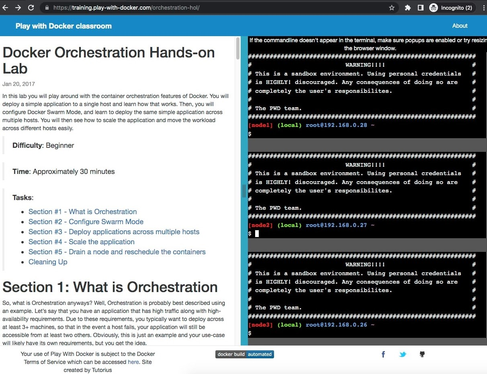</div>

## Section 2: Configure Swarm Mode

<div align="center">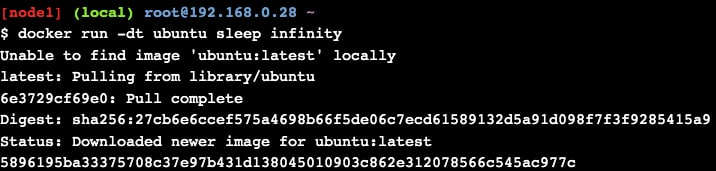</div>
<div align="center">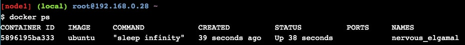</div>

### Step 2.1 - Create a Manager node

<div align="center">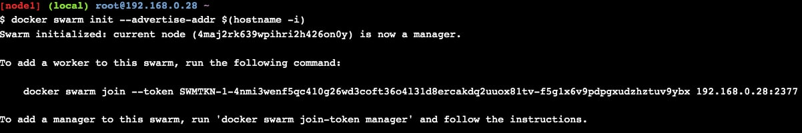</div>
<div align="center">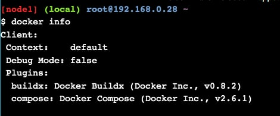</div>

### Step 2.2 - Join Worker nodes to the Swarm

<div align="center">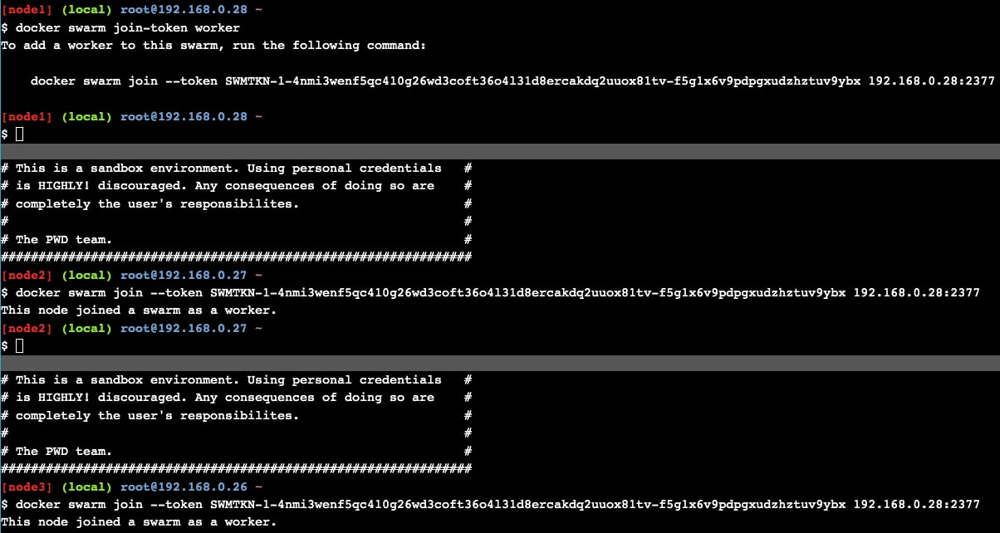</div>
<div align="center">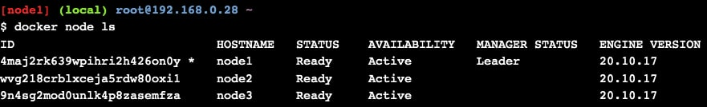</div>

## Section 3: Deploy applications across multiple hosts

### Step 3.1 - Deploy the application components as Docker services

<div align="center">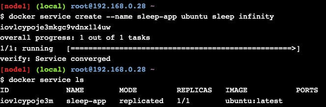</div>

## Section 4: Scale the application

<div align="center">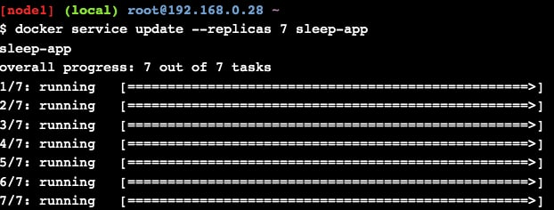</div>
<div align="center">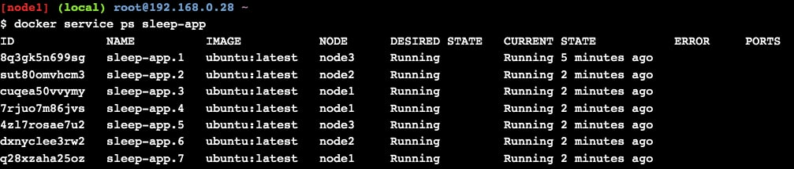</div>
<div align="center">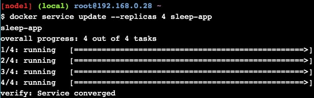</div>
<div align="center">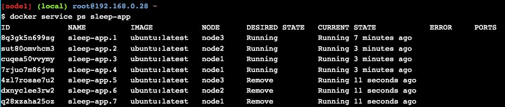</div>
<div align="center"></div>

## Section 5: Drain a node and reschedule the containers

<div align="center">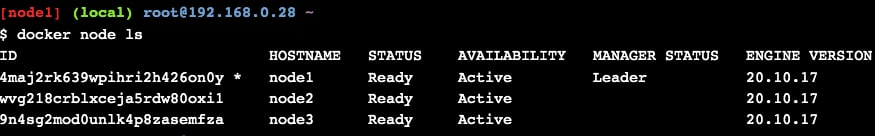</div>
<div align="center">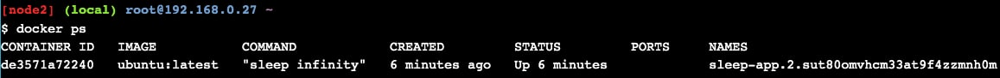</div>
<div align="center">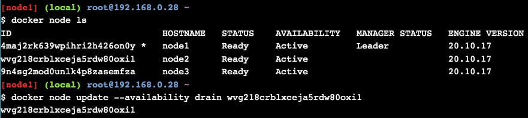</div>
<div align="center">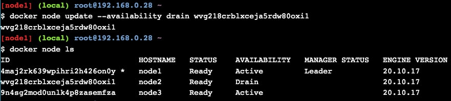</div>
<div align="center">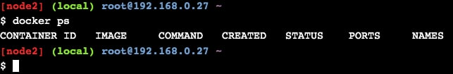</div>
<div align="center">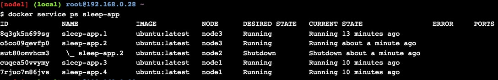</div>
<div align="center">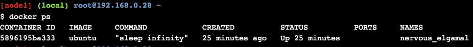</div>

## Cleaning Up

<div align="center">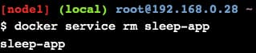</div>
<div align="center">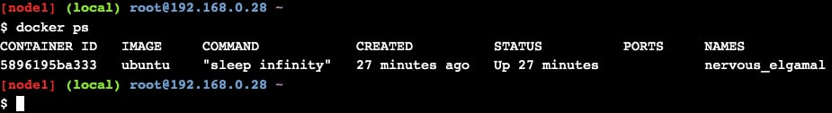</div>
<div align="center">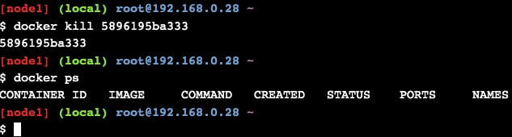</div>
<div align="center">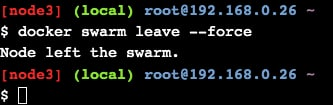</div>
<div align="center">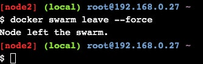</div>
<div align="center">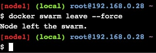</div>

Congratulations! You’ve completed this lab. You now know how to build a swarm, deploy applications as collections of services, and scale individual services up and down.
