# Kubernetes Intro

## Step 1 : [Minikube Installation & Configuration](https://minikube.sigs.k8s.io/docs/start/)
1. Download Minikube Installer and run the installer for the latest release in [this link](https://storage.googleapis.com/minikube/releases/latest/minikube-installer.exe).<br>
<div align="center"></div>
<div align="center"></div>

2. Start Cluster by run a command prompt with administrator access and then type the following command ```minikube start```:<br>
<div align="center"></div>

3. Try Interact With The Cluster and then type the following command ```kubectl get po -A``` in the command prompt.<br>
<div align="center">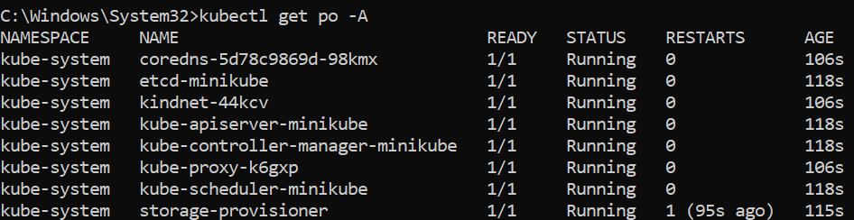</div>

4. Open a new terminal and type the following command ```minikube dashboard``` in the command prompt and then access in [this link](http://127.0.0.1:51134/api/v1/namespaces/kubernetes-dashboard/services/http:kubernetes-dashboard:/proxy/#/workloads?namespace=default).<br>
<div align="center">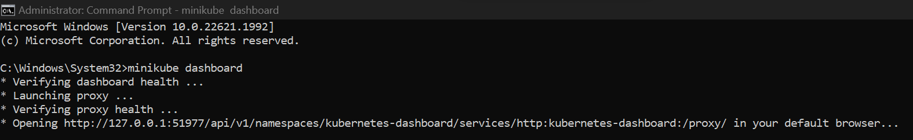</div>
Direct ke web browser
<div align="center"></div>

## Step 2 : [Create a Deployment](https://kubernetes.io/docs/tutorials/hello-minikube/#create-a-deployment)

1. Type the following command ```kubectl create``` to create a Deployment that manages a Pod in the command prompt. The Pod runs a Container based on the provided Docker image.<br>
<div align="center">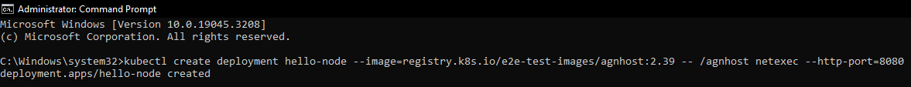</div>
2. See the Deployment that was created earlier, with following this command ```kubectl get deployments``` in the command prompt.<br>
<div align="center">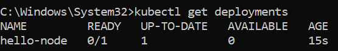</div>
3. See the Pod with following this command ```kubectl get pods``` in the command prompt.<br>
<div align="center">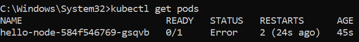</div>

4. See the cluster events with following this command ```kubectl get events``` in the command prompt.<br>
<div align="center">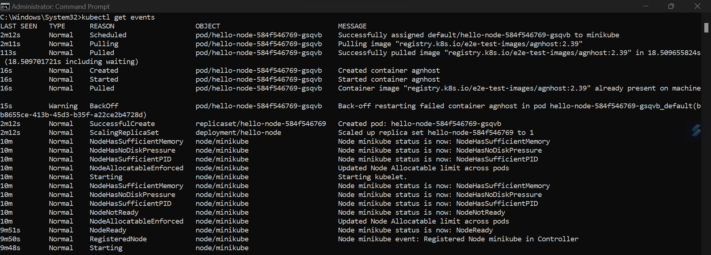</div>

5. See the kubectl configuration with following this command ```kubectl config view``` in the command prompt.<br>
<div align="center">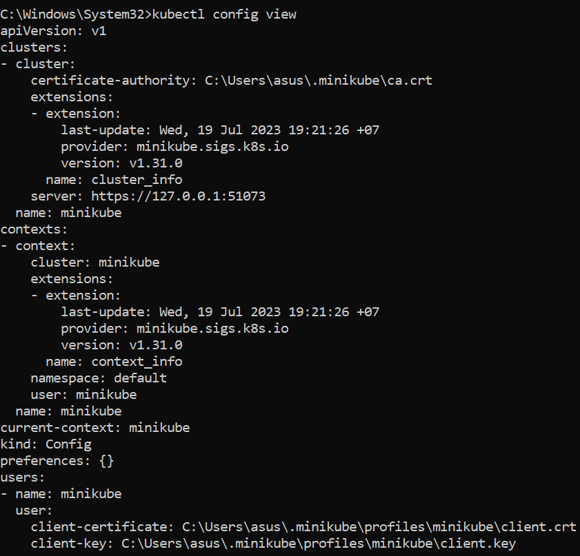</div>

## Step 3 : [Create a Service](https://kubernetes.io/docs/tutorials/hello-minikube/#create-a-service)

1. Expose the Pod to the public internet using the ```kubectl expose``` command:<br>
<div align="center">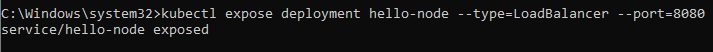</div>
The --type=LoadBalancer flag indicates that you want to expose your Service outside of the cluster.<br>
The application code inside the test image only listens on TCP port 8080. If you used kubectl expose to expose a different port, clients could not connect to that other port.

2. See the Service that was created earlier, with following this command ```kubectl get services``` in the command prompt.<br>
<div align="center">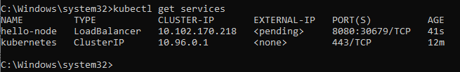</div>

3. Run the following command ```minikube service hello-node``` in the command prompt, and opens up a browser window that serves your app and shows the app's response.<br>
<div align="center">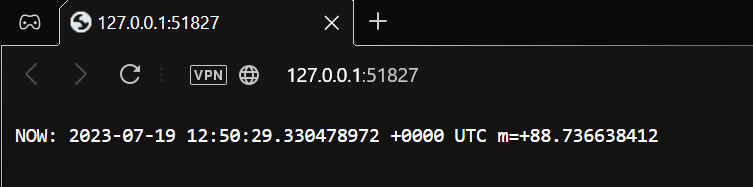</div>
<div align="center">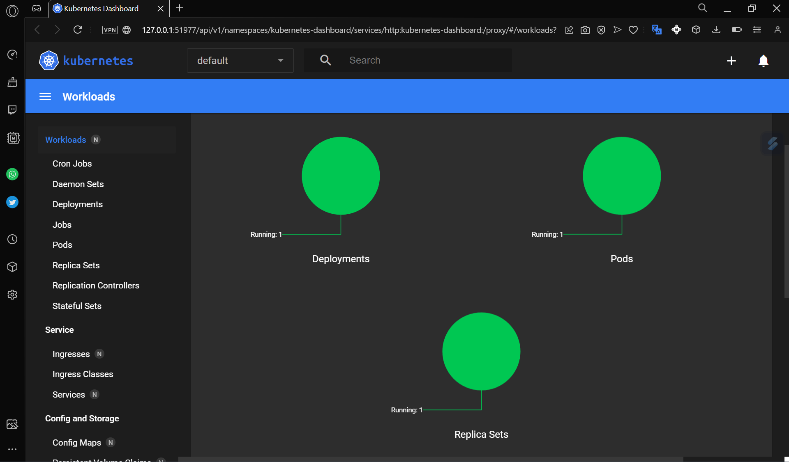</div>

## Step 4 : [Enable add-ons](https://kubernetes.io/docs/tutorials/hello-minikube/#enable-addons)

1. View list the currently supported addons with following this command ```minikube addons list```:<br>
<div align="center">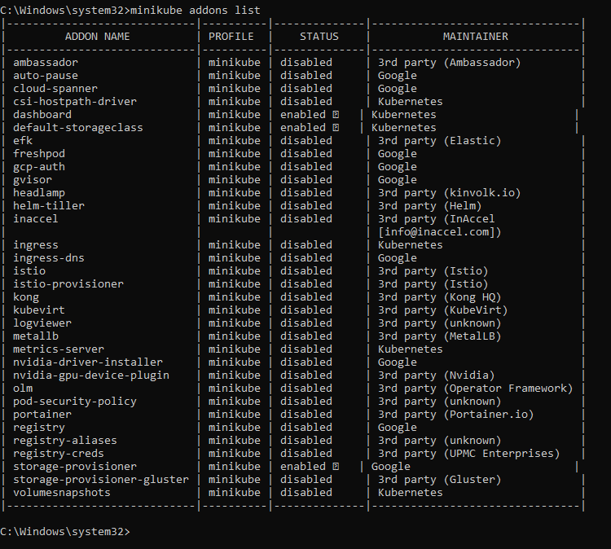</div>

2. Enable an addons metrics server, with following this command ```minikube addons enable metrics-server```:<br>
<div align="center">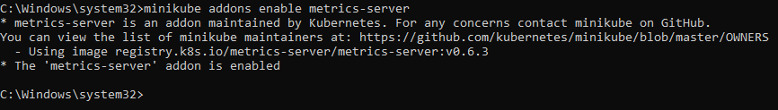</div>

3. View the Pod and Service you created by installing that addon with following this command ```kubectl get pod,svc -n kube-system```:<br>
<div align="center">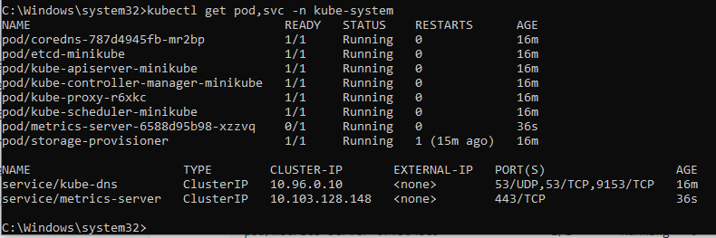</div>

4. Disable metrics server with following this command ```minikube addons disable metrics-server```:<br>
!<div align="center">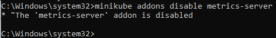</div>

## Step 5 : [Clean Up](https://kubernetes.io/docs/tutorials/hello-minikube/#clean-up)

1. Try to clean up the resources you created in your cluster, with following this command ```kubectl delete service hello-node & kubectl delete deployment hello-node```:<br>
<div align="center">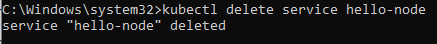</div><br>
<div align="center">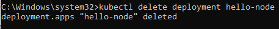</div>

2. Stop the Minikube cluster with following this command ```minikube stop```.<br>
<div align="center">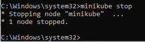</div>

3. Optionally, delete the Minikube Virtual Machine with following this command ```minikube delete```:<br>
<div align="center">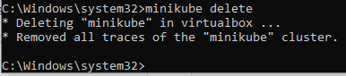</div>

If you want to use minikube again to learn more about Kubernetes, you don't need to delete it.
