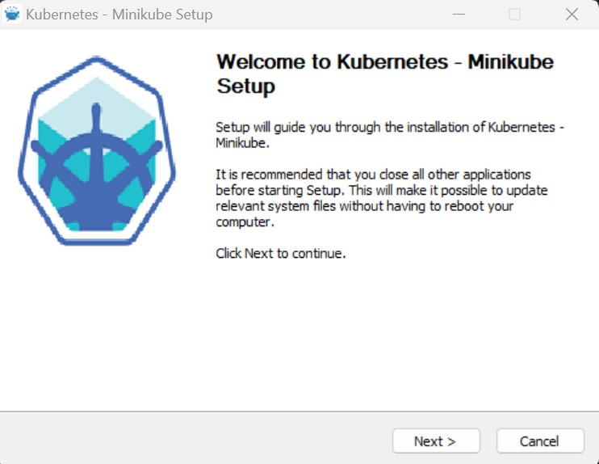
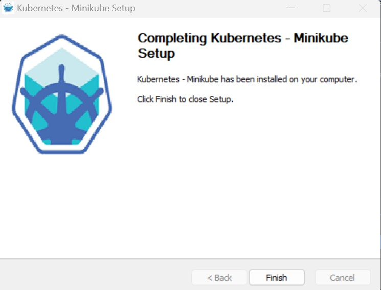
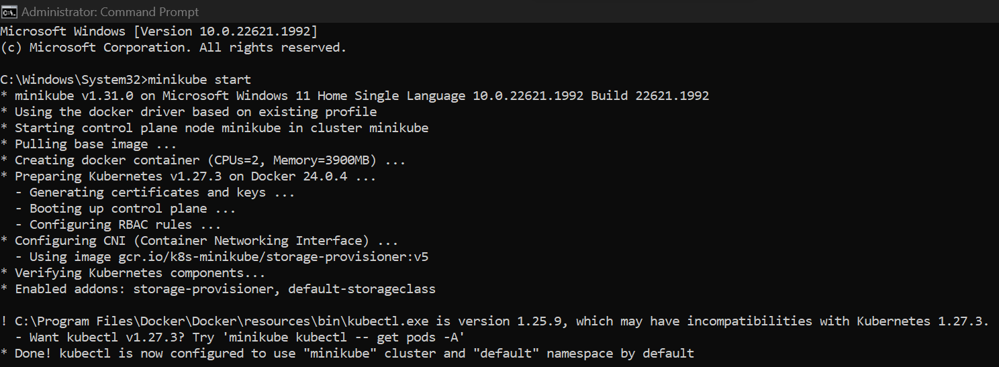

# Kubernetes Intro

## Step 1 : [Minikube Installation & Configuration](https://minikube.sigs.k8s.io/docs/start/)
1. Download Minikube Installer and run the installer for the latest release in [this link](https://storage.googleapis.com/minikube/releases/latest/minikube-installer.exe).<br>
<div></div>
<div></div>

2. Start Cluster by run a command prompt with administrator access and then type the following command ```minikube start```:<br>
<div></div>
